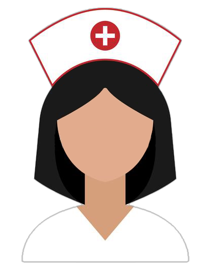
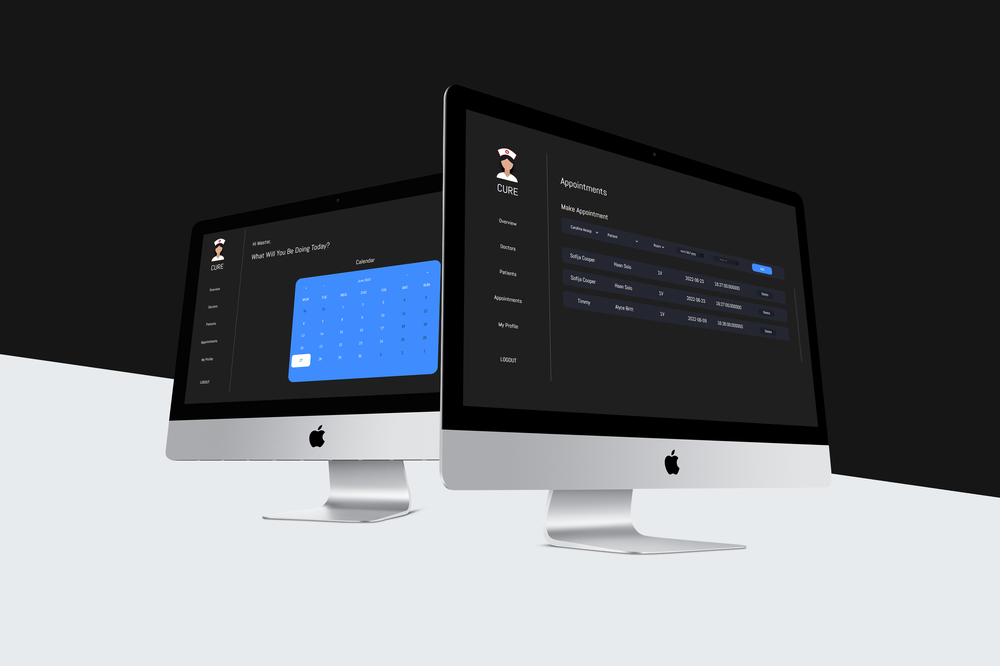

<!-- Repository Information & Links-->
<br />


<!-- HEADER SECTION -->
<h5 align="center" style="padding:0;margin:0;">Simon Riley</h5>
<h5 align="center" style="padding:0;margin:0;">170044</h5>
<h6 align="center">DV200 - Term 1 | 2022</h6>
</br>
<p align="center">

  <a href="https://github.com/SimonR1ley/CureT2Project">
    
  </a>
  
  <h3 align="center">Cure</h3>

  <p align="center">
    A web management system react project<br>
    
   <br />
   <br />
   <a href="path/to/demonstration/video">View Demo</a>
    ·
    <a href="https://github.com/SimonR1ley/CureT2Project/issues">Report Bug</a>
    ·
    <a href="https://github.com/SimonR1ley/CureT2Project/issues">Request Feature</a>
</p>
<!-- TABLE OF CONTENTS -->

## Table of Contents

* [About the Project](#about-the-project)
  * [Project Description](#project-description)
  * [Built With](#built-with)
* [Getting Started](#getting-started)
  * [Prerequisites](#prerequisites)
  * [How to install](#how-to-install)
* [Features and Functionality](#features-and-functionality)
* [Development Process](#development-process)
   * [Future Implementation](#peer-reviews)
* [Final Outcome](#final-outcome)
    * [Mockups](#mockups)
    * [Video Demonstration](#video-demonstration)
* [License](#license)
* [Contact](#contact)
* [Acknowledgements](#acknowledgements)

<!--PROJECT DESCRIPTION-->
## About the Project
<!-- header image of project -->


### Project Description

This app is a web management system built using react js and php.

### Built With

* [React](https://reactjs.org/)

<!-- GETTING STARTED -->
<!-- Make sure to add appropriate information about what prerequesite technologies the user would need and also the steps to install your project on their own mashines -->
## Getting Started

The following instructions will get you a copy of the project up and running on your local machine for development and testing purposes.

### Prerequisites

Ensure that you have the latest version of [NPM](https://www.npmjs.com/) installed on your machine. The [GitHub Desktop](https://desktop.github.com/) program will also be required.

### How to install

### Installation
Here are a couple of ways to clone this repo:

1. GitHub Desktop </br>
Enter `https://github.com/SimonR1ley/CureT2Project.git` into the URL field and press the `Clone` button.

2. Clone Repository </br>
Run the following in the command-line to clone the project:
   ```sh
   git clone https://github.com/SimonR1ley/CureT2Project.git
   ```
    Open `Software` and select `File | Open...` from the menu. Select cloned directory and press `Open` button

3. Install Dependencies </br>
Run the following in the command-line to install all the required dependencies:
   ```
   npm install axios
   npm install react-calendar
   npm install react-router-dom
   ```


<!-- FEATURES AND FUNCTIONALITY-->
<!-- You can add the links to all of your imagery at the bottom of the file as references -->
## Features and Functionality

* Login and Logout multiple receptionist profiles
* Authenticate, Validate and Secure receptionist profiles
* Add and Store Patient and Doctor information 
* Update or Delete Patient and Doctor Information
* Update the current logged in Receptionist Profile
* Setup or Delete appoints between doctors, patients and doctors rooms
* Showcase “todays” or “this weeks” appointments 


<!-- DEVELOPMENT PROCESS -->
## Development Process

I started the project off searching for inspiration for the design of the application.
I found a couple of ideas I liked and took parts from each idea to build my own.
I sketched a basic design of how I wanted the application to look.
Once I had an idea I went into figma and started to design the application.
Before building the application I started making the Database with all the necessary information.
I started replicating the design from figma.
Once most of the design was in place, I started implementing the functionality.
I started with the Users, Doctors, Patients and then Appointments.
I worked on getting the functionality for adding and removing the data.
I worked on editing the data.
Finally I added all the missing functionality and additional things.


### Future Implementation
<!-- stipulate functionality and improvements that can be implemented in the future. -->

* Getting profile pictures to show.

<!-- MOCKUPS -->
## Final Outcome

### Mockups


<br>


<!-- AUTHORS -->
## Authors

* **Simon Riley** - [SimonR1ley](https://github.com/SimonR1ley)

<!-- LICENSE -->
## License

Distributed under the MIT License. See `LICENSE` for more information.\

<!-- LICENSE -->
## Contact

* **Simon Riley** - [170044@virtualwindow.co.za](170044@virtualwindow.co.za) - [@simonbrettriley](https://www.instagram.com/instagram_handle/) 
* **Project Link** - https://github.com/SimonR1ley/CureT2Project

<!-- ACKNOWLEDGEMENTS -->
## Acknowledgements
<!-- all resources that you used and Acknowledgements here -->
* [React Three](https://www.npmjs.com/package/@react-three/fiber)

